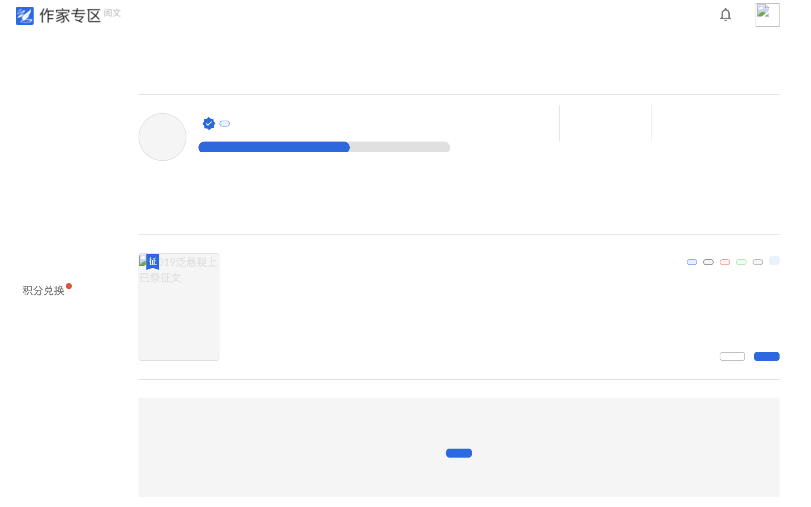

# ui-check

这是一个HTML边界检测生成工具

## Features

很多情况下，HTML原型都是最完美的状态，对于文字过多或者为空，图片尺寸大小等可能并没有做相关的设定。

该插会件生成test目录，你们包含两个文件夹，分别是`empty`、`overflow`，如下

```
./test                 -> test生成目录
  |--empty             -> 文本内容为空、图片为空的情况
  |--overflow          -> 文本内容很多、图片资源随机的情况
```

> 提示：目前仅适用于HTML，对于js动态生成的不会去检测

## ScreenShot

**原始页面**


**文本内容为空、图片为空的情况**



**文本内容很多、图片资源随机的情况**


各种极限情况一目了然

**Enjoy!**
